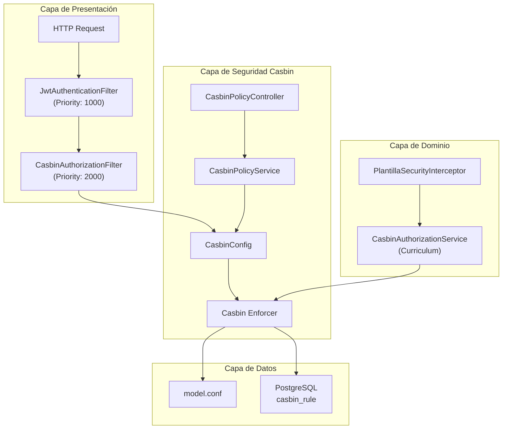
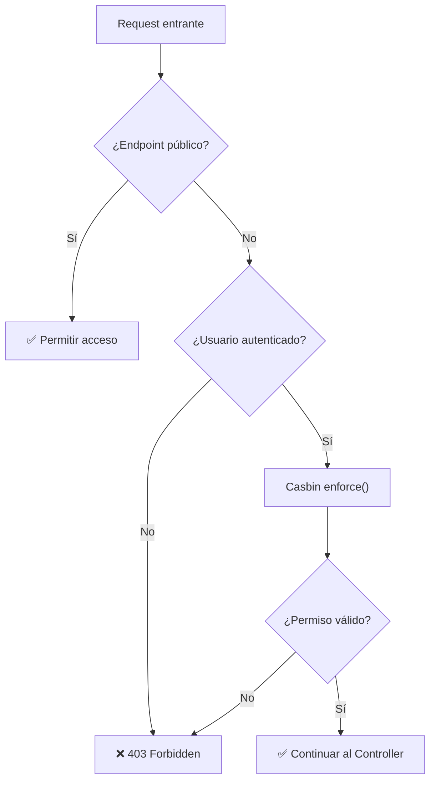
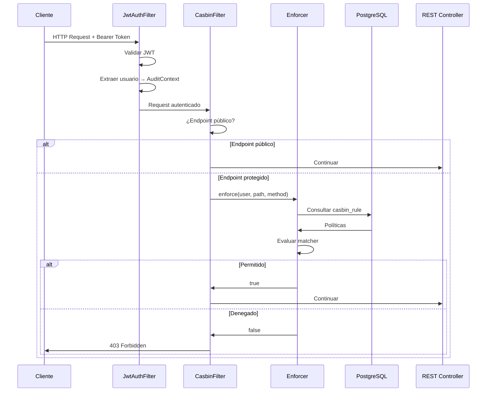
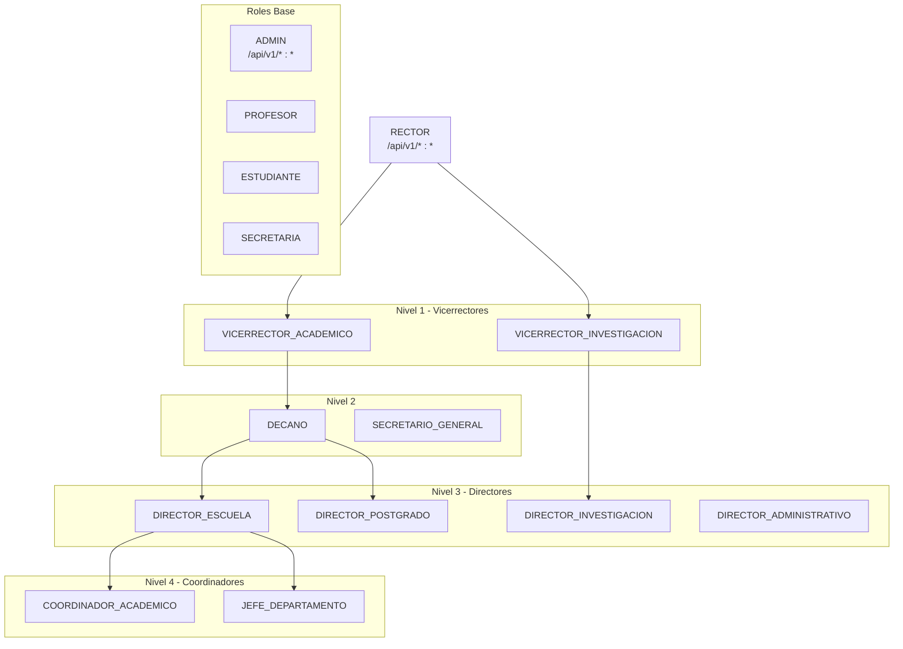
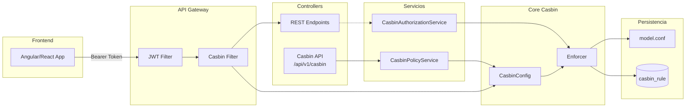

# Implementación de Casbin - Sistema de Autorización RBAC

## Tabla de Contenidos

1. [Introducción](#introducción)
2. [Arquitectura General](#arquitectura-general)
3. [Componentes del Sistema](#componentes-del-sistema)
4. [Modelo RBAC](#modelo-rbac)
5. [Flujo de Autorización](#flujo-de-autorización)
6. [Estructura de Archivos](#estructura-de-archivos)
7. [Políticas y Roles](#políticas-y-roles)
8. [API REST de Administración](#api-rest-de-administración)
9. [Integración con el Dominio](#integración-con-el-dominio)
10. [Health Check](#health-check)
11. [Ejemplos de Uso](#ejemplos-de-uso)

---

## Introducción

Este proyecto implementa **Casbin** como sistema de control de acceso basado en roles (RBAC) para el Sistema Académico UPeU. Casbin es una biblioteca de control de acceso potente y eficiente que soporta varios modelos de control de acceso como ACL, RBAC, ABAC, entre otros.

### Dependencias

```gradle
// Casbin - Control de Permisos
implementation 'org.casbin:jcasbin:1.55.0'
implementation 'org.casbin:jdbc-adapter:2.6.0'
```

---

## Arquitectura General



---

## Componentes del Sistema

### 1. CasbinConfig (Configuración Principal)

**Ubicación:** `src/main/java/upeu/edu/pe/security/casbin/CasbinConfig.java`

Es el bean CDI central que inicializa y gestiona el **Enforcer** de Casbin. Se carga al inicio de la aplicación (`@Startup`).

```java
@ApplicationScoped
@Startup
public class CasbinConfig {
    @Inject
    DataSource dataSource;

    @ConfigProperty(name = "casbin.model.path", defaultValue = "casbin/model.conf")
    String modelPath;

    private Enforcer enforcer;
}
```

**Funcionalidades principales:**

| Método | Descripción |
|--------|-------------|
| `enforce(sub, obj, act)` | Verifica si un sujeto puede realizar una acción sobre un objeto |
| `addPolicy(role, path, action)` | Agrega una política de permiso para un rol |
| `removePolicy(role, path, action)` | Elimina una política de permiso |
| `addRoleForUser(user, role)` | Asigna un rol a un usuario |
| `deleteRoleForUser(user, role)` | Elimina un rol de un usuario |
| `getRolesForUser(user)` | Obtiene todos los roles de un usuario |
| `reloadPolicy()` | Recarga políticas desde la base de datos |

### 2. CasbinAuthorizationFilter (Filtro JAX-RS)

**Ubicación:** `src/main/java/upeu/edu/pe/security/casbin/CasbinAuthorizationFilter.java`

Filtro que intercepta todas las peticiones HTTP y valida los permisos usando Casbin. Se ejecuta **después** del filtro de autenticación JWT.

```java
@Provider
@Priority(Priorities.AUTHORIZATION) // 2000 - después de autenticación (1000)
public class CasbinAuthorizationFilter implements ContainerRequestFilter
```

**Flujo de decisión:**



**Endpoints públicos (sin autorización):**

- `/openapi`, `/swagger-ui`
- `/q/*` (Quarkus dev endpoints)
- `/health`, `/metrics`
- `/api/v1/auth/*`
- `/api/v1/public/*`

### 3. CasbinPolicyService (Servicio de Políticas)

**Ubicación:** `src/main/java/upeu/edu/pe/security/casbin/CasbinPolicyService.java`

Servicio de aplicación que expone las operaciones de gestión de políticas.

```java
@ApplicationScoped
public class CasbinPolicyService {
    @Inject
    CasbinConfig casbinConfig;
    
    // Métodos: addPolicy, removePolicy, assignRole, removeRole, hasPermission, etc.
}
```

### 4. CasbinPolicyController (API REST)

**Ubicación:** `src/main/java/upeu/edu/pe/security/casbin/CasbinPolicyController.java`

Controlador REST para administrar políticas de Casbin. Solo accesible por rol ADMIN.

**Base Path:** `/api/v1/casbin`

---

## Modelo RBAC

**Ubicación:** `src/main/resources/casbin/model.conf`

```conf
# Modelo RBAC para Sistema Académico UPeU
# RBAC con herencia de roles y pattern matching para URLs

[request_definition]
r = sub, obj, act

[policy_definition]
p = sub, obj, act

[role_definition]
g = _, _

[policy_effect]
e = some(where (p.eft == allow))

[matchers]
m = g(r.sub, p.sub) && keyMatch2(r.obj, p.obj) && r.act == p.act
```

### Explicación del Modelo

| Sección | Descripción |
|---------|-------------|
| `[request_definition]` | Define la estructura de una solicitud: sujeto, objeto, acción |
| `[policy_definition]` | Define la estructura de una política: rol, path, método HTTP |
| `[role_definition]` | Define la relación usuario-rol (grouping policy) |
| `[policy_effect]` | Si **alguna** política permite, se otorga acceso |
| `[matchers]` | Lógica de evaluación con: roles (`g`), pattern matching (`keyMatch2`), comparación de acción |

### Pattern Matching con keyMatch2

`keyMatch2` soporta wildcards estilo REST:

| Patrón | Match | No Match |
|--------|-------|----------|
| `/api/v1/usuarios/*` | `/api/v1/usuarios/1` | `/api/v1/usuarios/1/roles` |
| `/api/v1/*` | `/api/v1/cualquier-cosa` | `/api/v2/algo` |

---

## Flujo de Autorización



---

## Estructura de Archivos

```
src/main/
├── java/upeu/edu/pe/
│   ├── security/casbin/
│   │   ├── CasbinConfig.java              # Configuración principal
│   │   ├── CasbinAuthorizationFilter.java # Filtro JAX-RS
│   │   ├── CasbinPolicyController.java    # API REST
│   │   └── CasbinPolicyService.java       # Servicio de políticas
│   │
│   ├── curriculum/domain/services/
│   │   └── CasbinAuthorizationService.java # Servicio específico de dominio
│   │
│   ├── curriculum/infrastructure/
│   │   └── PlantillaSecurityInterceptor.java # Interceptor CDI
│   │
│   └── shared/infrastructure/health/
│       └── CasbinHealthCheck.java         # Health check
│
├── resources/
│   ├── casbin/
│   │   └── model.conf                     # Modelo RBAC
│   │
│   └── db/migration/
│       └── V015__create_casbin_rules.sql  # Migración Flyway
```

---

## Políticas y Roles

### Tabla casbin_rule

```sql
CREATE TABLE IF NOT EXISTS casbin_rule (
    id SERIAL PRIMARY KEY,
    ptype VARCHAR(10) NOT NULL,  -- 'p' para políticas, 'g' para grupos
    v0 VARCHAR(256),             -- rol o usuario
    v1 VARCHAR(256),             -- path o rol asignado
    v2 VARCHAR(256),             -- acción HTTP (GET, POST, PUT, DELETE, *)
    v3 VARCHAR(256),
    v4 VARCHAR(256),
    v5 VARCHAR(256)
);
```

### Tipos de Registros

| ptype | Uso | Ejemplo |
|-------|-----|---------|
| `p` | Política (permiso de rol) | `('p', 'PROFESOR', '/api/v1/notas/*', 'POST')` |
| `g` | Grouping (asignación rol-usuario) | `('g', 'juan@upeu.edu.pe', 'PROFESOR')` |

### Jerarquía de Roles Implementada



### Permisos por Rol (Ejemplos)

#### ADMIN
```sql
INSERT INTO casbin_rule (ptype, v0, v1, v2) VALUES ('p', 'ADMIN', '/api/v1/*', '*');
```

#### PROFESOR
```sql
('p', 'PROFESOR', '/api/v1/evaluacion-notas/*', 'GET')
('p', 'PROFESOR', '/api/v1/evaluacion-notas/*', 'POST')
('p', 'PROFESOR', '/api/v1/evaluacion-notas/*', 'PUT')
('p', 'PROFESOR', '/api/v1/asistencias/*', 'GET')
('p', 'PROFESOR', '/api/v1/asistencias/*', 'POST')
('p', 'PROFESOR', '/api/v1/silabos/*', 'GET')
```

#### ESTUDIANTE
```sql
('p', 'ESTUDIANTE', '/api/v1/evaluacion-notas/*', 'GET')
('p', 'ESTUDIANTE', '/api/v1/matriculas/*', 'GET')
('p', 'ESTUDIANTE', '/api/v1/silabos/*', 'GET')
('p', 'ESTUDIANTE', '/api/v1/horarios/*', 'GET')
```

---

## API REST de Administración

**Base:** `/api/v1/casbin`

### Gestión de Políticas

#### Agregar Política
```http
POST /api/v1/casbin/policies
Content-Type: application/json

{
  "role": "PROFESOR",
  "path": "/api/v1/nuevo-recurso/*",
  "action": "GET"
}
```

#### Eliminar Política
```http
DELETE /api/v1/casbin/policies?role=PROFESOR&path=/api/v1/recurso/*&action=GET
```

### Gestión de Roles

#### Asignar Rol a Usuario
```http
POST /api/v1/casbin/roles/assign
Content-Type: application/json

{
  "userEmail": "juan.perez@upeu.edu.pe",
  "role": "PROFESOR"
}
```

#### Eliminar Rol de Usuario
```http
DELETE /api/v1/casbin/roles/remove?userEmail=juan@upeu.edu.pe&role=PROFESOR
```

#### Obtener Roles de Usuario
```http
GET /api/v1/casbin/roles/user/juan.perez@upeu.edu.pe
```

### Utilidades

#### Verificar Permiso
```http
GET /api/v1/casbin/check?user=juan@upeu.edu.pe&path=/api/v1/notas&action=POST
```

**Respuesta:**
```json
{
  "success": true,
  "message": "Verificación de permiso",
  "data": true
}
```

#### Recargar Políticas
```http
POST /api/v1/casbin/reload
```

---

## Integración con el Dominio

### CasbinAuthorizationService (Curriculum)

**Ubicación:** `src/main/java/upeu/edu/pe/curriculum/domain/services/CasbinAuthorizationService.java`

Servicio específico del módulo Curriculum que proporciona métodos de autorización semánticos para operaciones del dominio.

```java
@ApplicationScoped
public class CasbinAuthorizationService {
    
    // === Métodos de Sílabos ===
    boolean canCreateSilabo(AuthUsuario usuario);
    boolean canReadSilabo(AuthUsuario usuario);
    boolean canUpdateContenido(AuthUsuario usuario);
    boolean canUpdateEvaluaciones(AuthUsuario usuario);
    boolean canCongelarSilabo(AuthUsuario usuario);
    boolean canAprobarSilabo(AuthUsuario usuario);
    
    // === Métodos de Plantillas ===
    boolean canCrearPlantilla(AuthUsuario usuario);
    boolean canReadPlantilla(AuthUsuario usuario);
    boolean canPublicarPlantillaEnCampus(AuthUsuario usuario);
    
    // === Métodos de Publicaciones ===
    boolean canAdaptarPublicacion(AuthUsuario usuario);
}
```

### PlantillaSecurityInterceptor

**Ubicación:** `src/main/java/upeu/edu/pe/curriculum/infrastructure/PlantillaSecurityInterceptor.java`

Interceptor CDI que valida permisos a nivel de método usando anotaciones.

```java
@Interceptor
@RequirePlantillaPermission("")
@Priority(Interceptor.Priority.APPLICATION)
public class PlantillaSecurityInterceptor {
    
    @AroundInvoke
    public Object validatePermission(InvocationContext context) throws Exception {
        // Obtiene la anotación y valida el permiso
    }
}
```

**Uso con anotación:**
```java
@RequirePlantillaPermission("plantilla:create")
public PlantillaSilabo crearPlantilla(CrearPlantillaCommand command) {
    // Solo se ejecuta si el usuario tiene permiso
}
```

---

## Health Check

**Ubicación:** `src/main/java/upeu/edu/pe/shared/infrastructure/health/CasbinHealthCheck.java`

Verifica que Casbin esté funcionando correctamente como parte del health check de la aplicación.

```http
GET /q/health/ready
```

**Respuesta:**
```json
{
  "status": "UP",
  "checks": [
    {
      "name": "Casbin RBAC health check",
      "status": "UP",
      "data": {
        "status": "operational",
        "policies": 45,
        "roles": 5,
        "model": "loaded"
      }
    }
  ]
}
```

---

## Ejemplos de Uso

### 1. Verificar permiso programáticamente

```java
@Inject
CasbinConfig casbinConfig;

public void ejemploVerificacion() {
    boolean permitido = casbinConfig.enforce(
        "profesor@upeu.edu.pe",    // sujeto (email)
        "/api/v1/evaluacion-notas/1", // objeto (path)
        "POST"                      // acción (método HTTP)
    );
    
    if (!permitido) {
        throw new ForbiddenException("No tiene permisos");
    }
}
```

### 2. Asignar rol a nuevo usuario

```java
@Inject
CasbinPolicyService policyService;

public void asignarRolProfesor(String email) {
    boolean asignado = policyService.assignRole(email, "PROFESOR");
    if (asignado) {
        log.info("Rol PROFESOR asignado a {}", email);
    }
}
```

### 3. Agregar nueva política dinámicamente

```java
@Inject
CasbinPolicyService policyService;

public void agregarPermisoRecurso() {
    policyService.addPolicy(
        "COORDINADOR_ACADEMICO",
        "/api/v1/nuevo-recurso/*",
        "GET"
    );
}
```

### 4. Uso del servicio de dominio

```java
@Inject
CasbinAuthorizationService authService;

public void crearSilabo(AuthUsuario usuario, SilaboData data) {
    if (!authService.canCreateSilabo(usuario)) {
        throw new ForbiddenException("No puede crear sílabos");
    }
    // Lógica de creación...
}
```

---

## Configuración

### application.properties / application.yml

```yaml
# Casbin Configuration
casbin:
  model:
    path: casbin/model.conf  # Ruta del modelo en classpath
```

### Variables de Base de Datos

Casbin usa el `DataSource` configurado en Quarkus para conectarse a PostgreSQL y persistir las políticas en la tabla `casbin_rule`.

---

## Buenas Prácticas

1. **Principio de mínimo privilegio**: Asignar solo los permisos necesarios
2. **Usar wildcards con cuidado**: `/api/v1/*` da acceso a TODOS los recursos
3. **Recargar políticas después de cambios masivos**: Usar `POST /api/v1/casbin/reload`
4. **Monitorear health checks**: Verificar que Casbin esté operativo
5. **Logging**: Los logs de Casbin muestran las decisiones de autorización
6. **Separar políticas por módulo**: Usar comentarios en el SQL de migración

---

## Diagrama Completo de Integración



---

## Referencias

- [Casbin Official Documentation](https://casbin.org/)
- [jCasbin GitHub](https://github.com/casbin/jcasbin)
- [JDBC Adapter](https://github.com/jcasbin/jdbc-adapter)
- [Pattern Matching Functions](https://casbin.org/docs/en/function)
