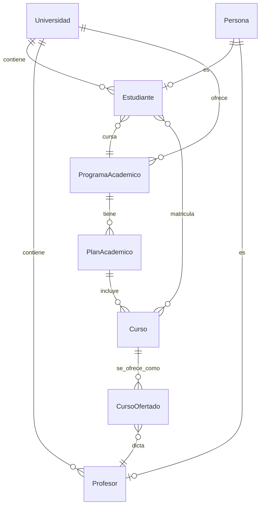

# 📚 Documentación del Proyecto

## 🎓 Sistema de Gestión Universitaria - SaaS Multitenancy

Bienvenido a la documentación completa del sistema. Aquí encontrarás toda la información necesaria para entender, desarrollar y mantener el proyecto.

---

## 📋 Índice de Documentación

### 🗃️ Base de Datos

| Archivo | Descripción | Tamaño |
|---------|-------------|--------|
| [**DICCIONARIO_BASE_DATOS.md**](DICCIONARIO_BASE_DATOS.md) | Documentación completa de 33 tablas con diagrama ERD | 2039 líneas |
| [**base_datos.json**](base_datos.json) | Datos estructurados en JSON | - |
| [**schema_completo.sql**](schema_completo.sql) | Scripts DDL para PostgreSQL | 835 líneas |
| [**RESUMEN_DOCUMENTACION.md**](RESUMEN_DOCUMENTACION.md) | Resumen ejecutivo de la documentación | - |

### 🐍 Scripts Python

| Script | Propósito | Uso |
|--------|-----------|-----|
| [**generador_documentacion_db.py**](generador_documentacion_db.py) | Genera documentación automáticamente desde entidades JPA | `python generador_documentacion_db.py` |
| [**visualizador_db.py**](visualizador_db.py) | Explorador interactivo de base de datos | `python visualizador_db.py` |
| [**generar_sql_ddl.py**](generar_sql_ddl.py) | Genera scripts SQL DDL | `python generar_sql_ddl.py` |

### 📖 Guías

| Guía | Contenido |
|------|-----------|
| [**README_GENERADOR.md**](README_GENERADOR.md) | Manual completo del sistema de documentación |

### 🏗️ Arquitectura

| Documento | Descripción |
|-----------|-------------|
| [**SISTEMA-AUTORIDADES.md**](SISTEMA-AUTORIDADES.md) | Diseño del sistema de autoridades universitarias |

---

## 🚀 Inicio Rápido

### 1️⃣ Ver Documentación de Base de Datos
```bash
# Abrir con VS Code o navegador
code docs/DICCIONARIO_BASE_DATOS.md
```

### 2️⃣ Explorar Tablas Interactivamente
```bash
cd docs
python visualizador_db.py

# O buscar tabla específica:
python visualizador_db.py estudiante
```

### 3️⃣ Regenerar Documentación
```bash
cd docs
python generador_documentacion_db.py
```

### 4️⃣ Generar Scripts SQL
```bash
cd docs
python generar_sql_ddl.py
# Salida: schema_completo.sql
```

---

## 📊 Estructura del Sistema

### Módulos del Sistema

```
Sistema de Gestión Universitaria
├── 🎓 Academic (23 tablas)
│   ├── Gestión de Estudiantes
│   ├── Gestión de Profesores
│   ├── Gestión de Cursos
│   ├── Matrículas
│   ├── Evaluaciones
│   └── Programas Académicos
│
├── 🔐 Security (6 tablas)
│   ├── Autenticación (JWT)
│   ├── Autorización (Roles/Permisos)
│   └── Usuarios
│
├── 💰 Finance (3 tablas)
│   ├── Pagos
│   └── Cuentas Corrientes
│
└── 📚 Catalog (1 tabla)
    └── Categorías
```

### Diagrama de Relaciones Principales



---

## 🎯 Funcionalidades Documentadas

### ✅ Sistema Académico
- Gestión de universidades (multitenancy)
- Registro de personas
- Administración de estudiantes
- Gestión de profesores y empleados
- Programas académicos y planes de estudio
- Cursos y oferta académica
- Matrículas
- Periodos académicos
- Evaluaciones y notas
- Asistencias
- Horarios
- Estructura organizacional

### ✅ Sistema de Seguridad
- Autenticación con JWT
- Gestión de usuarios
- Roles y permisos
- Control de acceso granular
- Tokens de refresco

### ✅ Sistema Financiero
- Registro de pagos
- Cuentas corrientes de estudiantes
- Aplicación de pagos a deudas

---

## 📈 Estadísticas del Proyecto

| Métrica | Valor |
|---------|-------|
| **Total de Tablas** | 33 |
| **Líneas de Documentación MD** | 2,039 |
| **Líneas de SQL DDL** | 835 |
| **Scripts Python** | 3 |
| **Módulos** | 4 (Academic, Security, Finance, Catalog) |
| **Relaciones Mapeadas** | 50+ |
| **Campos Documentados** | 200+ |

---

## 🔧 Tecnologías

### Backend
- **Framework:** Quarkus 3.x
- **Java:** 21 LTS
- **ORM:** Hibernate Panache
- **Validación:** Jakarta Validation
- **Mapeo:** MapStruct 1.5.5

### Base de Datos
- **RDBMS:** PostgreSQL 14+
- **Migraciones:** Liquibase/Flyway (opcional)

### Seguridad
- **Autenticación:** JWT Custom (HS256)
- **Autorización:** RBAC (Role-Based Access Control)

### Documentación
- **Generación:** Python 3.8+
- **Formato:** Markdown, JSON, SQL
- **Diagramas:** Mermaid

---

## 📝 Convenciones

### Nomenclatura de Base de Datos

| Elemento | Convención | Ejemplo |
|----------|------------|---------|
| Tablas | `snake_case` | `programa_academico` |
| Columnas | `snake_case` | `fecha_nacimiento` |
| Foreign Keys | `<tabla>_id` | `persona_id` |
| Índices | `idx_<tabla>_<campo>` | `idx_estudiante_codigo` |
| Constraints | `uk_<tabla>_<campos>` | `uk_persona_documento` |

### Nomenclatura Java

| Elemento | Convención | Ejemplo |
|----------|------------|---------|
| Entidades | `PascalCase` | `ProgramaAcademico` |
| Campos | `camelCase` | `fechaNacimiento` |
| Métodos | `camelCase` | `findByEstadoAcademico()` |
| Constantes | `UPPER_SNAKE_CASE` | `MAX_CREDITOS` |

---

## 🔄 Workflow de Desarrollo

### 1. Modificar Entidades
```java
@Entity
@Table(name = "mi_tabla")
public class MiEntidad extends AuditableEntity {
    @Column(name = "mi_campo")
    private String miCampo;
}
```

### 2. Regenerar Documentación
```bash
cd docs
python generador_documentacion_db.py
```

### 3. Revisar Cambios
```bash
git diff docs/DICCIONARIO_BASE_DATOS.md
```

### 4. Generar SQL (si es necesario)
```bash
python generar_sql_ddl.py
```

### 5. Commit
```bash
git add docs/
git commit -m "docs: Actualizar documentación de BD"
```

---

## 🎓 Recursos de Aprendizaje

### Para Nuevos Desarrolladores

1. **Leer primero:**
   - [RESUMEN_DOCUMENTACION.md](RESUMEN_DOCUMENTACION.md)
   - [DICCIONARIO_BASE_DATOS.md](DICCIONARIO_BASE_DATOS.md) (Sección de Índice)

2. **Explorar:**
   ```bash
   python visualizador_db.py
   # Opción 1: Ver resumen general
   # Opción 3: Listar tablas por módulo
   ```

3. **Entender estructura:**
   - Ver diagrama ERD en `DICCIONARIO_BASE_DATOS.md`
   - Revisar ejemplos de datos en cada tabla

4. **Practicar:**
   - Buscar tablas específicas
   - Leer reglas de negocio
   - Analizar relaciones

### Para Arquitectos

1. **Revisar diseño:**
   - Diagrama ERD completo
   - Relaciones entre módulos
   - Constraints y normalización

2. **Analizar JSON:**
   ```python
   import json
   data = json.load(open('base_datos.json'))
   # Análisis programático
   ```

3. **Validar SQL:**
   - Revisar `schema_completo.sql`
   - Verificar índices y constraints

---

## 🐛 Solución de Problemas

### Error: No se encuentran entidades
**Solución:** Ejecutar desde el directorio correcto
```bash
cd c:\Cursos\alpha\bdalpha\lamb-upeu-sis\docs
python generador_documentacion_db.py
```

### Error: Python no encontrado
**Solución:** Verificar instalación de Python 3.8+
```bash
python --version
# o
python3 --version
```

### Error: Archivo JSON no encontrado
**Solución:** Generar primero la documentación
```bash
python generador_documentacion_db.py
python visualizador_db.py
```

---

## 📞 Contacto y Soporte

Para reportar problemas o sugerencias:
1. Crear un issue en el repositorio
2. Contactar al equipo de desarrollo
3. Revisar documentación adicional

---

## 🎯 Próximos Pasos

### Mejoras Planificadas

- [ ] Generación de diagramas PlantUML
- [ ] Exportación a HTML interactivo
- [ ] Análisis de normalización automático
- [ ] Detección de ciclos en relaciones
- [ ] Generación de datos de prueba
- [ ] Integración con Liquibase
- [ ] Dashboard web de documentación
- [ ] API REST para consulta de esquema

### Contribuir

Las contribuciones son bienvenidas. Por favor:
1. Fork del repositorio
2. Crear branch para tu feature
3. Hacer commits con mensajes claros
4. Abrir Pull Request

---

## 📜 Licencia

Este proyecto es parte del Sistema de Gestión Universitaria.  
Todos los derechos reservados © 2025

---

## 🎉 ¡Gracias!

Por usar y contribuir al Sistema de Gestión Universitaria.

**Última actualización:** Noviembre 2025  
**Versión de documentación:** 1.0.0  
**Generado automáticamente por:** Sistema de Documentación Python

---

## 📚 Enlaces Rápidos

- [Ver Diccionario Completo](DICCIONARIO_BASE_DATOS.md)
- [Manual del Generador](README_GENERADOR.md)
- [Resumen Ejecutivo](RESUMEN_DOCUMENTACION.md)
- [Scripts SQL](schema_completo.sql)
- [Datos JSON](base_datos.json)

---

**¿Necesitas ayuda?** Ejecuta:
```bash
python visualizador_db.py
```
